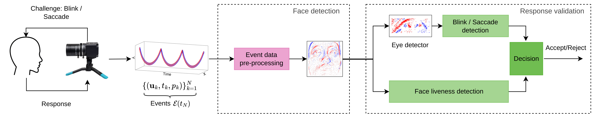

# Event-based Face Liveness Detection
[Nicolas Mastropasqua](https://scholar.google.com/citations?user=m-mTz2kAAAAJ&hl=es), [Ignacio Bugueno-Cordova](https://ibugueno.github.io/), [Rodrigo Verschae](https://rodrigo.verschae.org/), [Daniel Acevedo](https://scholar.google.com/citations?user=1Yv2P6oAAAAJ&hl=es), [Pablo Negri](https://scholar.google.com/citations?user=bMnUgmcAAAAJ&hl=es), 

[arXiv](https://arxiv.org/abs/2604.26285) | [Website](https://ev-latam.github.io/event-face-liveness)


<div align=center style="display:flex;">
  
</div>

This repository provides a minimal and practical pipeline to reproduce the experiments from FME Workshop, FG 2026 paper: *"Event-based Liveness Detection using Temporal Ocular Dynamics: An Exploratory Approach"*. Please cite our paper if you find our work useful for your research:
```
@inproceedings{mastropasqua2026event,
  title={Event-based Liveness Detection using Temporal Ocular Dynamics: An Exploratory Approach},
  author={Mastropasqua, Nicolas and Bugueno-Cordova, Ignacio and Verschae, Rodrigo and Acevedo, Daniel and Negri, Pablo},
  booktitle={2026 IEEE 20th International Conference on Automatic Face and Gesture Recognition (FG)},
  pages={1--9},
  year={2026},
  organization={IEEE}
}
```
------------------------------------------------------------------------

# Abstract

Face liveness detection has been extensively studied using RGB cameras, achieving strong performance under controlled conditions but often failing to generalize across sensors and attack scenarios. In this work, we explore event cameras as an alternative sensing modality for liveness detection based on temporal ocular dynamics. Event cameras capture sparse, asynchronous changes in brightness with microsecond resolution, enabling precise analysis of fast eye movements such as saccades. Replay attacks cannot faithfully reproduce these dynamics due to temporal resampling and display artifacts, leading to distinctive spatio-temporal patterns in the event domain. We design a **data collection protocol to extend RGBE-Gaze with replay-attack recordings**, yielding an event-based fake counterpart for liveness detection. We analyze event-driven temporal features from eye regions and evaluate their effectiveness for **ocular motion segmentation** and **liveness classification**. Our results show that event-based representations enable reliable discrimination between genuine and replayed sequences, **achieving up to 95.37\% top-1 accuracy** with a spiking convolutional neural network. These preliminary findings highlight the potential of event-based sensing for robust and low-latency liveness detection.

------------------------------------------------------------------------

# Project Overview

This project focuses on event-based Face Liveness Detection and Temporal Blink/Saccade Segmentation in a remote-eye scenario. We employ a Spiking Convolutional Neural Network (SCNN) for face liveness detection, levaraging the [Spikinjelly framework](https://github.com/fangwei123456/spikingjelly) [2] and a Temporal Convolutional Network (TCN) [3] for temporal blink/saccade segmentation.

# Installation

Install dependencies:

    pip install -r requeriments.txt


# Dataset

The RGBE-Gaze dataset by Zhao et al [1] is a multimodal dataset designed for remote gaze tracking using spatio-temporal synchronized RGB (FLIR BFS-U3-16S2C) and event (Prophesee EVK4) cameras, totalling 66 subjects. Their dataset can be downloaded [here](https://github.com/GuangrongZhao/RGBE-Gaze).

For this work, we introduced a replay attack dataset, derived from RGBE-Gaze, designed to advance research in event-based liveness detection. If you want to request access to our samples, please contact us.

# Project Structure

    scnn/
    ├── train.py
    ├── dataset.py
    ├── model.py
    └── utils.py
    blinks/
    ├── blink_detection.py
    saccades/
    ├──tcnn_train.py
    ├──tcnn.py
    ├──train_utils.py

------------------------------------------------------------------------

## Face Liveness Detection

The model operates on raw event streams stored as `.npy` files and
converts them into dense spatio-temporal tensors.

### Input Format

Each sample is stored as:

    [N, 4] = (x, y, t, p)

Where:

-   `x, y`: pixel coordinates\
-   `t`: timestamp\
-   `p`: polarity (-1 or +1)

------------------------------------------------------------------------

### Expected Dataset Structure

    data/
    ├── train/
    │   ├── fake/
    │   └── real/
    ├── val/
    │   ├── fake/
    │   └── real/

Folder names are used as labels:

-   `fake` → 0\
-   `real` → 1

------------------------------------------------------------------------

### Event Representation

Raw events are converted into a dense tensor:

    [T, 2, H, W]

Where:

-   `T`: number of temporal bins (recommended: 8)
-   `2`: polarity channels
-   `H, W`: spatial resolution

------------------------------------------------------------------------

### Model

The architecture is a **Spiking CNN (SCNN)** composed of:

-   Convolutional layers
-   Batch Normalization
-   LIF spiking neurons
-   Temporal aggregation (mean over time)

------------------------------------------------------------------------

### Training

Run training with:

    python train.py

The training pipeline:

-   Loads `.npy` event files
-   Converts events → tensor
-   Trains SCNN
-   Evaluates on validation set
-   Saves best model based on **ACER**

------------------------------------------------------------------------

### Metrics

This project uses **biometric evaluation metrics**:

-   Accuracy
-   APCER (Attack error)
-   BPCER (Bona fide error)
-   ACER (primary metric)
-   AUC-ROC

ACER is used as the main metric for model selection.

------------------------------------------------------------------------

### Notes

-   Model input: `[T, B, C, H, W]`

-   Always reset spiking states:

        functional.reset_net(model)
        
-   Use GPU for better performance

------------------------------------------------------------------------


## Temporal Blink/Saccade Segmentation

The TCN model operates on raw event streams stored as `.npy` files. For this stage, we trained the model on the original RGBE samples to evaluate the performance of temporal saccade segmentation. 
A straightforward method to detect blinks by applying simple signal processing methods to the raw event streams can also be found in the `blink` folder. We also provide our blinks and saccades ground truth annotations in the folder `annotations`.

------------------------------------------------------------------------

### Training

Run training with:

    python tcnn_train.py --epochs 100 --base_path /path/to/RGBE_Gaze/

------------------------------------------------------------------------

### Metrics

Following the evaluation protocol in [3], predictions are matched to ground truth segments using temporal Intersection-over-Union (IoU), and a prediction is considered correct if its IoU exceeds the 0.5 threshold. Performance is reported using micro-averaged Precision, Recall, and F1-score computed over the matched segments.


------------------------------------------------------------------------
# References

1. G. Zhao, Y. Shen, C. Zhang, Z. Shen, Y. Zhou and H. Wen, "RGBE-Gaze: A Large-Scale Event-Based Multimodal Dataset for High Frequency Remote Gaze Tracking," in IEEE Transactions on Pattern Analysis and Machine Intelligence, vol. 47, no. 1, pp. 601-615, Jan. 2025.

2. Fang W, Chen Y, Ding J, Yu Z, Masquelier T, Chen D, Huang L, Zhou H, Li G, Tian Y. SpikingJelly: An open-source machine learning infrastructure platform for spike-based intelligence. Sci Adv. 2023 Oct 6;9(40):eadi1480. 

3. C. Lea, M. D. Flynn, R. Vidal, A. Reiter, and G. D. Hager. Temporal convolutional networks for action segmentation and detection. In 2017 IEEE Conference on Computer Vision and Pattern Recognition (CVPR), pages 1003–1012, 2017
